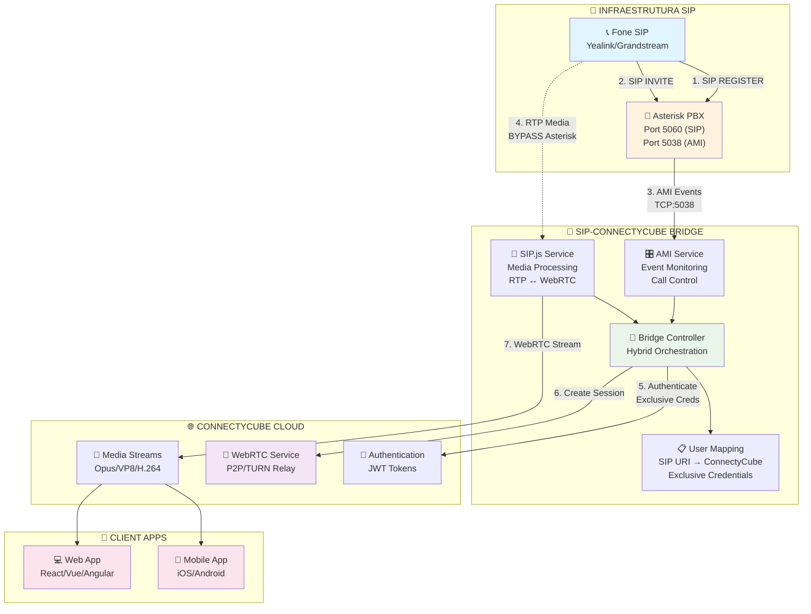
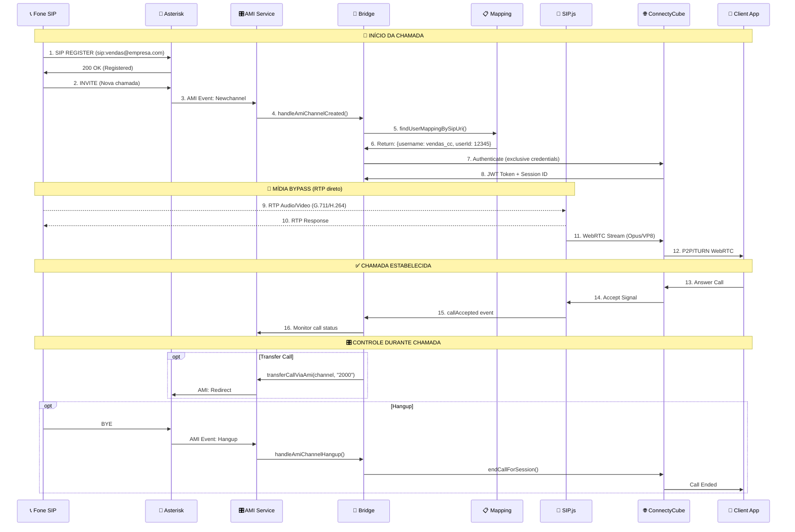
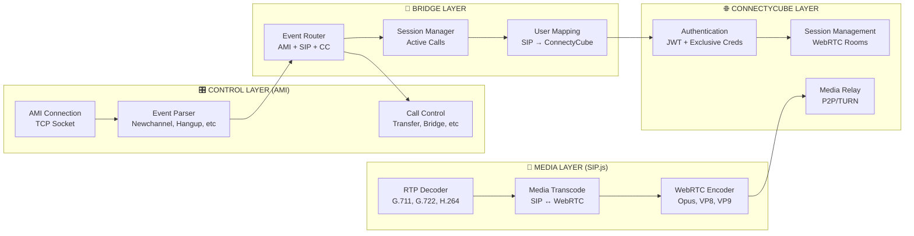
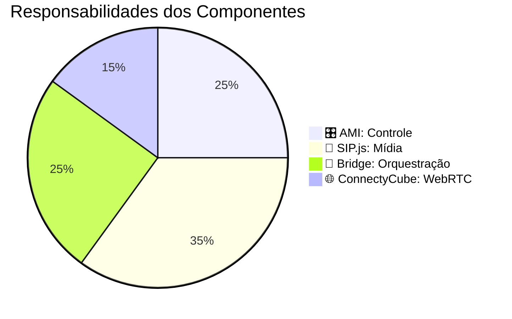
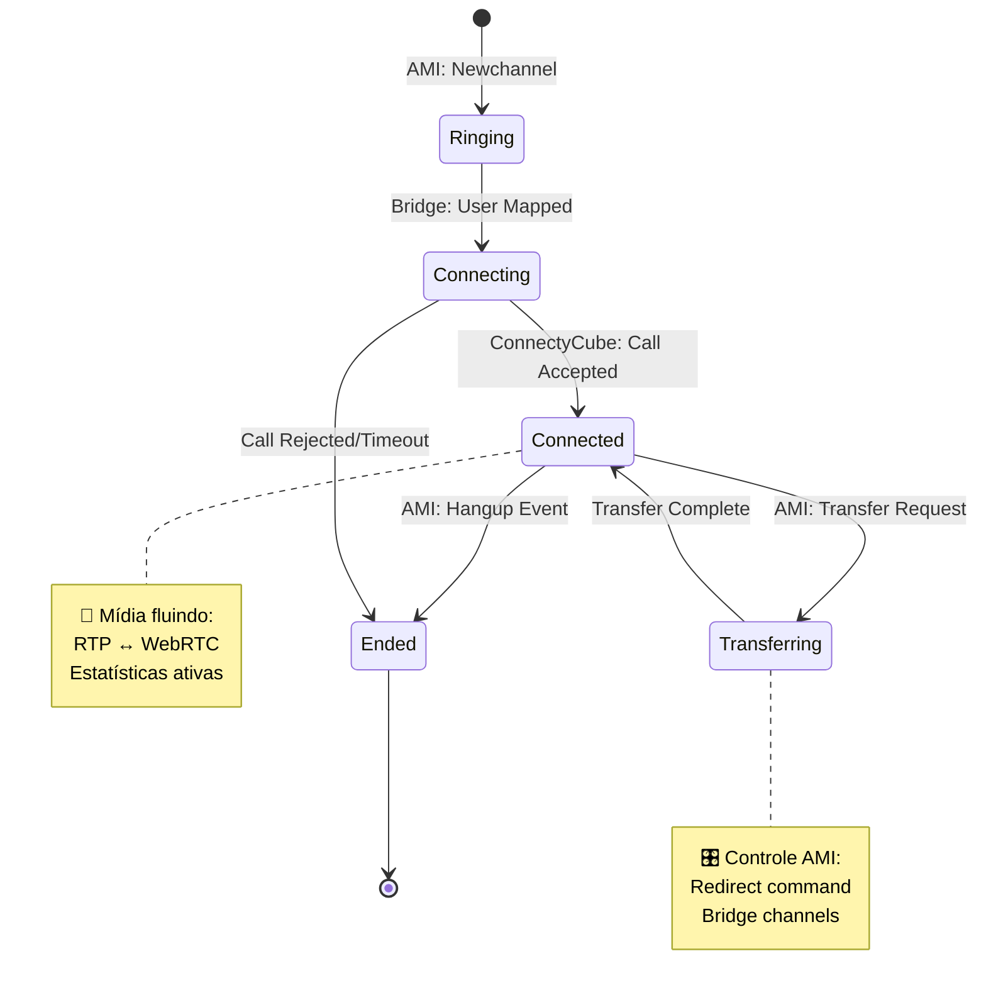

# 🎯 Diagrama de Fluxo: Arquitetura Híbrida SIP-ConnectyCube Bridge

## 📊 Visão Geral da Arquitetura



## 🔄 Fluxo de Uma Chamada Completa



## 🏗️ Arquitetura de Componentes



## 📊 Separação de Responsabilidades



## 🔄 Estados de Uma Sessão



## 🎯 Exemplo Prático: Fluxo de Código

```typescript
// 🎛️ AMI detecta nova chamada
this.amiService.on('channelCreated', (event: AmiCallEvent) => {
    console.log('📞 Novo canal AMI:', event);
    this.handleAmiChannelCreated(event); // 🌉 Bridge processa
});

// 🌉 Bridge mapeia usuário
const sipUri = this.extractSipUriFromChannel(event.channel);
const userMapping = findUserMappingBySipUri(sipUri); // 📋 Lookup

// 🌐 ConnectyCube autentica com credenciais exclusivas
const connectyCubeSession = await this.connectyCubeService.createUserSession(
    sipUri, // "sip:vendas@empresa.com"
    sessionId
);

// 🎵 SIP.js processa mídia (futuro)
// const mediaStream = await this.sipClient.processMedia(channel);

// 🎛️ Controle durante chamada
await this.transferCallViaAmi(channel, "2000"); // AMI command
await this.hangupChannelViaAmi(channel);        // AMI command
```

Esta arquitetura híbrida oferece:
- ✅ **Controle total** via AMI (Asterisk)
- ✅ **Mídia otimizada** via SIP.js (futuro)
- ✅ **WebRTC nativo** via ConnectyCube
- ✅ **Flexibilidade** máxima para casos de uso complexos
